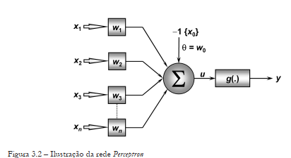
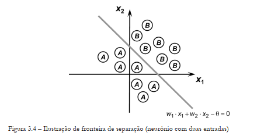

# Perceptron para avaliação de cliente com base em dados bancários

O *Perceptron* é a forma mais simples de configuração de uma rede neural artificial. Foi idelizado por Rosenblat (1958), com o objetivo de implementar um modelo computacional inspirado na retina, para ser utilizado como um elemento de percepção eletrônica de sinais.

O *Perceptron* é constituído de apenas uma camada neural, com um único neurônio. A figura abaixo ilustra uma rede *Perceptron* constituída de $n$ sinais de entrada e somente uma saída.

O *Perceptron* é utilizado como classificador de padrões, cuja função é dividir classes que sejam linearmente separáveis. A figura abaixo ilustra uma reta posicionada na fronteira de separabilidade.

O objetivo deste repositório é implementar uma rede perceptron para classificar os clientes de uma base de dados bancários como bons ou maus. Com finalidade didática, a implementação não contará com as etapas de data cleaning e data wrangling.

## Referências
SILVA, Ivan Nunes da e SPATTI, Danilo Hernane e FLAUZINO, Rogério
Andrade. Redes neurais artificiais para engenharia e ciências aplicadas. .
São Paulo: Artliber Editora. . Acesso em: 23 dez. 2023. , 2010
